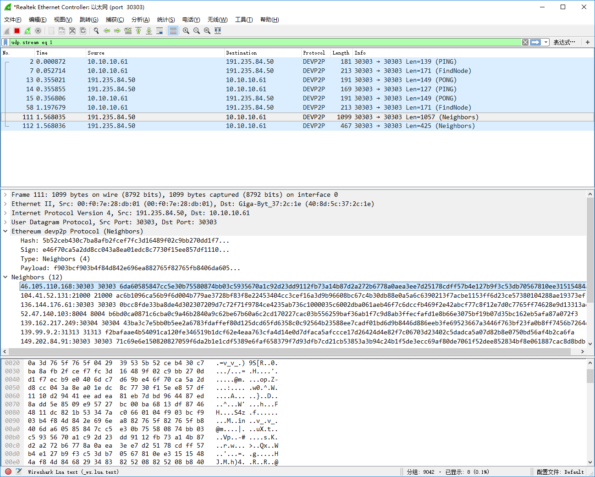

# ethereum_devp2p_wireshark_dissector
This is Ethereum devp2p protocol dissector plugin for wireshark.

Support RLP decode and PING/PONG/FINDNODE/NEIGHBORS packets.

## INSTALL
1. Download ethereum.lua
2. Put it in your Wireshark plugins folder.
    - On MAC OSX: ~/.config/wireshark/plugins (older Wireshark versions it may be: ~/.wireshark/plugins)
    - On Windows: C:\Users\<username>\AppData\Roaming\Wireshark\plugins
    - On Linux: ~/.wireshark/plugins

## SCREENSHOTS

## About us
BCSEC is a blockchain security group which aims to elevate the security of entire blockchain ecosystem. Please visit https://bcsec.org for more information.

## REFERENCE
- devp2p overview https://github.com/ethereum/devp2p
- Node Discovery Protocol v4 https://github.com/ethereum/devp2p/blob/master/discv4.md
- RLP (Recursive Length Prefix) https://github.com/ethereum/wiki/wiki/RLP   